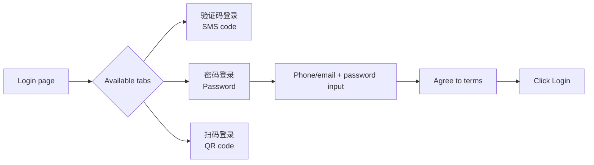

# Chinese Website SMS Verification Login Flow

Many Chinese websites use phone-number + SMS code authentication. They often have aggressive anti-bot detection that causes page instability.

## Common Page Structure

Login page typically has:
- Phone number textbox
- Verification code textbox
- "Get verification code" (获取验证码) button
- User agreement checkbox (must be checked before sending code)
- "Login/Register" button (disabled until code entered)
- Tab switch between "SMS login" (验证码登录) and "QR code login" (扫码登录)

## Login Mode Tabs

Login pages typically have two tabs:
- **验证码登录** (SMS code login) — default, uses phone + SMS code
- **扫码登录** (QR code login) — uses mobile app to scan QR

Tab switching can also trigger bot detection / empty page. Always snap again after switching.

## SMS Code Login Flow (验证码登录)

```
browser_navigate(login_url)
browser_snapshot()  # get fresh refs
browser_click(ref of checkbox/LabelText)  # agree to terms
browser_type(ref of phone textbox, phone_number)
browser_click(ref of "get verification code" button)
# Ask user for SMS code
browser_type(ref of code textbox, code_from_user)
browser_click(ref of login button)
```

## QR Code Login Flow (扫码登录)

1. Click the tab element for 扫码登录 (ref=e3 typically)
2. `browser_snapshot()` often returns empty/minimal text for QR pages
3. Use `browser_vision()` to capture the screenshot of the QR code
4. The QR code image path is in `screenshot_path` field of the vision result
5. If user wants the QR sent to QQ/WeChat:

   **Option A — send_message (if home channel is configured):**
   - `send_message(target='qqbot:CHANNEL_ID')` with MEDIA: path tag
   - If `No home channel set for qqbot` error, user must configure via `hermes config set QQBOT_HOME_CHANNEL <channel_id>`

   **Option B — NapCat WebSocket API (fallback):**
   - NapCat runs in Docker. The OneBot WebSocket server is on **port 3001 with no token** (token is empty string in config). Port 6099 may exist but usually requires a token that differs from the HTTP/webui token. Check with `docker exec napcatf cat /app/napcat/config/onebot11.json`.
   - **Image delivery via file path (container-accessible):**
     1. Copy the QR screenshot into the NapCat container: `docker cp <screenshot_path> napcatf:/tmp/qrcode.png`
     2. Also keep a copy on the host: `cp <screenshot_path> /root/qrcode.png`
     3. Script uses `file:'file:///tmp/qrcode.png'` in message params
   - **Image delivery via base64 (more portable, no container dependency):**
     1. Copy to host: `cp <screenshot_path> /root/qrcode.png`
     2. Script reads file, converts to base64: `readFileSync('/root/qrcode.png').toString('base64')`
     3. Script uses `file:'base64://' + imageBase64` in message params
   - **Script pattern (send to QQ user):**
     ```javascript
     import { WebSocket } from 'ws';
     import { readFileSync } from 'fs';

     const imageBase64 = readFileSync('/root/qrcode.png').toString('base64');
     const ws = new WebSocket('ws://127.0.0.1:3001');

     ws.on('open', () => {
       ws.send(JSON.stringify({
         action: 'send_private_msg',
         params: {
           user_id: 3240171077,  // target QQ number
           message: [
             { type: 'text', data: { text: '扫码登录二维码' } },
             { type: 'image', data: { file: 'base64://' + imageBase64 } }
           ]
         },
         echo: 'send_qr'
       }));
     });

     ws.on('message', (data) => {
       const resp = JSON.parse(data.toString());
       if (resp.echo === 'send_qr') {
         console.log('Status:', resp.status, 'Retcode:', resp.retcode);
         ws.close();
         process.exit(0);
       }
     });

     setTimeout(() => process.exit(1), 15000);
     ```
   - **Critical: script must keep WebSocket open until the response with matching echo is received.** Simply sending and closing immediately may result in the message not being delivered even though the write succeeded.
   - Run from host: `cd /opt/napcat && node send_qr.js`
   - Success response: `{"status":"ok","retcode":0,"data":{"message_id":...}}`
   - **Known limitation**: Even with `status: ok`, QQ may silently drop proactive DMs to users who haven't previously interacted with the bot (QQ platform policy). The API can't distinguish this. If user says "没收到" despite `status: ok` and `retcode: 0`, suggest:
     - Ask the user to send a message to the bot first (establish a DM session)
     - Or send the QR image to a QQ group the bot is in, using `group_id` instead of `user_id`
     - Or display the QR directly in the conversation (CLI/terminal)
   - **Pre-written send script**: Create `/opt/napcat/send_qr.js` once (see template below), then send quickly with `cp screenshot /root/qrcode.png && cd /opt/napcat && node send_qr.js`

## Password Login Flow (密码登录)

Many Chinese login pages have a **密码登录** (password login) tab/button alongside the SMS and QR code tabs. This is useful when SMS codes are not arriving.



Flow:
```
browser_navigate(login_url)
browser_snapshot()
# Find and click the password login tab (often ref=e17 for "密码登录" static text)
browser_click(ref of password_login_tab)
browser_snapshot()
# Now inputs change to: phone/email textbox + password textbox
browser_type(ref of phone_textbox, phone_or_email)
browser_type(ref of password_textbox, password)
browser_click(ref of checkbox_label)  # agree to terms
browser_click(ref of login_button)
```

## No SMS Code Received — Troubleshooting

If the user says "没有验证码" (no SMS received), try these in order:

### 1. Check for CAPTCHA/Slider Blocking SMS Sending

**This is the #1 cause of "没有验证码"** — clicking "获取验证码" does NOT directly send an SMS. Instead, it first triggers a **CAPTCHA popup** (slider/puzzle verification). The SMS is only sent after the CAPTCHA is completed.

Many Chinese sites use **火山引擎 (Volcengine) CAPTCHA** (identified by `id="vc_captcha_wrapper"` and class `vc-captcha-verify slide`). Key signs:
- A white overlay/popup appears over the login form
- It shows a puzzle image with a draggable slider
- Text: "按住左边按钮拖动完成上方拼图" (Hold the left button and drag to complete the puzzle)
- The overlay is a `fixed` `<div>` with `z-index: 111111` as a direct child of `<body>`
- Has a close button (`role="button"` with class `vc-captcha-close-btn`)

**Detection via console**:
   ```javascript
   document.getElementById('vc_captcha_wrapper')  // if exists, CAPTCHA is active
   ```

   **Dismissing the CAPTCHA** — Volcano Engine captcha exposes a global `closeCaptcha()` function that closes the popup. You can also click the close button if it has one (`.captcha_verify_bar--close`):
   ```javascript
   closeCaptcha();  // global function, closes the popup
   // Alternative: click close button
   document.querySelector('#vc_captcha_wrapper .captcha_verify_bar--close')?.click();
   ```

**Detection via body children** — look for a fixed overlay with high z-index:
```javascript
Array.from(document.body.children).filter(el => 
  window.getComputedStyle(el).position === 'fixed'
)[0]  // check innerHTML for 'vc_captcha'
```

**If CAPTCHA is active, the SMS was never sent.** You must either:
- Complete the slider puzzle (difficult to automate — Volcano Engine has anti-bot behavior detection)
- Close the CAPTCHA popup (if a close button exists) and try a different login method
- Use `browser_vision()` with `annotate=true` to visually inspect the CAPTCHA overlay

**Automating slider CAPTCHA** is generally unreliable. Volcano Engine and similar services detect synthetic mouse events. Instead:
- Switch to **扫码登录 (QR Code Login)** 
- Or ask the user to check their phone for missed CAPTCHA attempts
- Or use the global `closeCaptcha()` function to dismiss the popup and try a different approach

### Why CDP Events Also Fail Against ByteDance

Even **CDP `Input.dispatchMouseEvent`** (which generates `isTrusted=true` events at the OS input level) does NOT bypass ByteDance/火山引擎 CAPTCHA. Verified findings:

1. **Events DO reach the page** — CDP-dispatched pointerdown/pointermove/pointerup events appear on `document` listeners with `isTrusted=true`, with proper coordinates and sequence
2. **Slider CAN be physically moved via CDP** — when connected to the **correct** headless browser (not the visible 9222 one), realistic trajectory sequences produce `transform: translateX(127px)` on `.dragger-item`. The key is connecting to the right port (see dual browser section above).
3. **BUT verification still fails** — even with the slider visually at the correct gap position, the captcha's internal behavioral model rejects the interaction. The captcha tracks **event flow** (timing coherence, micro-velocity, acceleration profiles), not just visual state.
4. **Direct DOM manipulation also fails** — setting `dragger.style.transform = 'translateX(Npx)'` and `draggedArea.style.width` moves the slider visually but does NOT trigger the captcha's verification callback. The captcha SDK monitors the raw event stream, not CSS properties.
5. **Correct distance calculation matters** — the distance from button's left edge to the mouse cursor position determines the slider transform. Formula: `target_x + (btn_center_x - btn_left)` or simpler: just calculate as `gap_position - btn_left_edge`. Example: track left=470, width=340, gap at 38%=599.2, btn_left=472 → distance=127.2px.

ByteDance's detection stack includes:
- Canvas fingerprinting to detect automation
- Behavioral analysis beyond mouse events (timing coherence, event propagation path, velocity curves)
- Composition thread-level checks (events delivered but not consumed by the compositor)
- Touch vs pointer event verification
- Machine learning on trajectory patterns (acceleration, micro-corrections, overshoot/pullback)

**The 4 remaining viable routes (per user confirmation, ranked by practicality):**

| Rank | Route | Description | Success Rate |
|------|-------|-------------|-------------|
| 1 | **打码平台** | 超级鹰/图鉴/若快: Screenshot captcha → API returns distance → CDP slide | 95%+ |
| 2 | **Playwright page.mouse** | Real system-level mouse via Playwright API (NOT synthetic CDP), with Bezier curves + random jitter + overshoot/pullback. Distinction from CDP Input.dispatchMouseEvent is debatable (same backend), but trajectory quality matters crucially. | 60-70% |
| 3 | **Fingerprint + residential proxy** | Dynamic residential IP + clean browser fingerprint (canvas, WebGL, UA) per session | Varies |
| 4 | **Human-assisted** | Screenshot → user estimates gap % → controlled slide | 100% |

**Bottom line:** ByteDance CAPTCHA requires residential proxy + real human interaction or a third-party solving service (如 超级鹰/图鉴). Pure automation — even with CDP — is insufficient. No free, pure-code solution reliably bypasses 2026-era ByteDance captcha.

### A note about Hermes' dual browser architecture

Hermes runs **TWO** Chromium processes:
1. **Visible browser** on port 9222 (`--user-data-dir=/tmp/chrome_v5`, with xvfb) — the one with a display window
2. **Headless browser** on a random port (`--remote-debugging-port=0`, user-data-dir matches pattern `/tmp/agent-browser-chrome-*`) — the one Hermes' `browser_navigate`/`browser_click` tools actually control

To find the headless browser's port:
```bash
# Method 1: Check listener ports for the agent-browser process
ss -tlnp | grep chrom

# Method 2: Get the PID and find its listening port
ps aux | grep 'agent-browser-chrome' | grep -v grep | awk '{print $2}'
ss -tlnp | grep pid=<PID>,

# Method 3: Check the Chrome debugging JSON endpoint
curl -s http://127.0.0.1:<PORT>/json
```

**Why this matters for CDP:** Connecting CDP to port 9222 (the visible browser) sends events to the WRONG browser instance. Always find the headless browser port first.

### ByteDance Captcha Element Structure

When the captcha is active, inspect these specific elements:

```javascript
// Full structure
document.querySelector('.captcha_verify_slide--button').innerHTML
// -> .captcha-slider-box (track, width usually ~340px)
//   -> .captcha-slider-tips (text: "按住左边按钮拖动完成上方拼图")
//   -> .dragger-box
//     -> .captcha-slider-dragged-area (width tracks progress)
//     -> .dragger-item (transform: translateX(0px) — KEY state indicator)
//       -> .captcha-slider-btn (the visual button with SVG icon)

// Get slider dimensions
var track = document.querySelector('.captcha-slider-box');
var btn = document.querySelector('.captcha-slider-btn');
var btnRect = btn.getBoundingClientRect();
var trackRect = track.getBoundingClientRect();
JSON.stringify({
    btn_center_x: (btnRect.left + btnRect.right) / 2,
    btn_center_y: (btnRect.top + btnRect.bottom) / 2,
    track_left: trackRect.left,
    track_right: trackRect.right,
    track_width: trackRect.width,
})
```

**Fanqienovel (番茄小说网) slider measurements:**
- Track: left=470, right=810, width=340px
- Button center: x=504, y=431
- Gap typically at ~38% of track width (≈ position 599, ~95px from button center)

### 2. Check if the number is registered

The phone number may not be registered on this site. SMS codes are only sent to registered accounts on many Chinese platforms.

### 3. Ask about SMS filtering

SMS from short codes (used by most Chinese platforms) can be filtered by carriers or phone spam blockers. Ask the user to check their SMS spam/junk folder.

### 4. Switch to 密码登录 (Password Login)

This is often a reliable alternative. Many login pages have a "密码登录" tab/button.

   ⚠️ **Password login may be blocked**: Some Chinese sites (e.g., fanqienovel.com) disable password login for certain accounts and show the error: *"为保证账号安全，请使用手机验证码登录"* (For account security, please use SMS verification code to login). The password input will have `aria-invalid="true"` and `arco-input-error` CSS class. If this happens, password login is not an option — you must use SMS or QR code login.

   ⚠️ **Password login may be blocked**: Some Chinese sites (e.g., fanqienovel.com) disable password login for certain accounts and show the error: *"为保证账号安全，请使用手机验证码登录"* (For account security, please use SMS verification code to login). The password input will have `aria-invalid="true"` and `arco-input-error` CSS class. If this happens, password login is not an option — you must use SMS or QR code login.

### 5. Switch to 扫码登录 (QR Code Login)

Another reliable alternative. Use `browser_vision()` to capture and share the QR code.

### 6. Check rate limiting

The site may have a cooldown period between SMS sends. Wait 60+ seconds before retrying. Reload the page fully between attempts.

## Browser Session NOT Authenticated After Phone QR Scan

**Critical and non-obvious insight**: When the user scans a QR code with their phone app and says "登录成功" (login successful), the **Hermes browser session is NOT authenticated**. The QR scan authenticates the user's phone app/session, not the automated browser tab. The browser will still show the login page on next navigation or snapshot.

This is because QR code login works by:
1. Browser shows a QR code encoding a temporary token/session ID
2. User scans with their phone app (which is already logged in)
3. The phone app tells the server "approve this session"
4. The **browser tab** (not a separate automated browser) receives a push notification and redirects to the dashboard

Since Hermes uses a fully automated browser (Browserbase), there is no persistent session bridge. The QR code's approval signal doesn't reach the Hermes browser session.

**After phone-based QR login success, to access the website in-browser you must:**
- Use **password login** with credentials entered directly in-browser
- Or use **SMS/code login** with a code sent to the user's phone
- Or import cookies from the user's real browser session (if available)

Do NOT trust "登录成功" from the user as meaning the browser is logged in — it only means their phone app authorized the attempt.

## Image/Text CAPTCHA (Not Just Slider)

Some Chinese sites (including fanqienovel) may show an **image/text CAPTCHA** instead of (or in addition to) the Volcano Engine slider. Signs:

- A popup with a picture (landscape, objects, text) and a text input
- Text: "请完成下列验证后继续" (Please complete the verification below to continue)
- May require reading distorted text from the image, or identifying objects
- Has a refresh button and a close button

**How to handle:**
1. Screenshot the CAPTCHA and send to user: `browser_vision()` → MEDIA: path
2. Ask user to read the code and tell you what to type
3. Type the code into the input, then click submit/verify
4. If verification fails, click refresh and retry

Alternatively, if the CAPTCHA image contains text, you can try OCR:
1. Extract the CAPTCHA image element via browser console: `document.querySelector('.captcha-img')?.src` or look for `` in the popup overlay
2. Download and run OCR with `python3 -c "import pytesseract; ..."` (requires tesseract installed)

**Note:** The OpenRouter free tier for vision models (used by Hermes' `auxiliary.vision`) has a **daily limit of ~50 requests**. Once exhausted, you'll see error 429: "Rate limit exceeded: free-models-per-day". In this case, send the screenshot to the user directly rather than trying to auto-analyze.

## Human-like Slider JS Snippet (Console Paste)

When the site does show a slider CAPTCHA (e.g., Volcano Engine), you can attempt bypass by pasting this into the browser console. It simulates human-like dragging with velocity ramping and Y-axis jitter:

```javascript
function humanDragSlider(sliderDom, targetX) {
    const rect = sliderDom.getBoundingClientRect();
    let startX = rect.left;
    let startY = rect.top;
    const endX = startX + targetX;
    const totalTime = Math.floor(Math.random() * 300) + 600;
    const steps = Math.floor(totalTime / 10);
    let currentX = startX;
    let currentY = startY;

    const mouseDownEvent = new MouseEvent('mousedown', {
        clientX: startX, clientY: startY,
        bubbles: true, cancelable: true
    });
    sliderDom.dispatchEvent(mouseDownEvent);

    let stepList = [];
    for (let i = 0; i < steps; i++) {
        let rate;
        if (i < steps * 0.3) rate = Math.pow(i / (steps * 0.3), 1.2);
        else if (i < steps * 0.7) rate = 1;
        else rate = 1 - Math.pow((i - steps * 0.7) / (steps * 0.3), 1.2);
        let moveX = (endX - startX) * rate;
        let moveY = (Math.random() - 0.5) * 2;
        stepList.push({x: moveX, y: currentY + moveY});
    }

    let idx = 0;
    const interval = setInterval(() => {
        if (idx >= steps) {
            clearInterval(interval);
            const mouseUpEvent = new MouseEvent('mouseup', {
                clientX: endX, clientY: currentY,
                bubbles: true, cancelable: true
            });
            sliderDom.dispatchEvent(mouseUpEvent);
            console.log("滑块滑动完成");
            return;
        }
        const moveEvent = new MouseEvent('mousemove', {
            clientX: stepList[idx].x, clientY: stepList[idx].y,
            bubbles: true
        });
        document.dispatchEvent(moveEvent);
        idx++;
    }, 10);
}
```

**Call it from console:**
```javascript
const slider = document.querySelector(".slider-btn");
const distance = 180;  // adjust to gap position
humanDragSlider(slider, distance);
```

**Limitations:** This may still fail against Volcano Engine/ByteDance CAPTCHA which uses canvas fingerprinting and behavioral analysis beyond mouse events. Always ask user for slider gap position (they can estimate from the screenshot) rather than guessing.

### vision_analyze Fallback When browser_vision Fails

Sometimes inline `browser_vision()` fails with "LLM returned invalid response" errors. The screenshot IS still captured — the path is in the error's `screenshot_path` field. Recover it:

```
# error.screenshot_path = /root/.hermes/cache/screenshots/browser_screenshot_xxx.png
vision_analyze(image_url="/root/.hermes/cache/screenshots/browser_screenshot_xxx.png", question="Read all text in this screenshot")
```

This directly calls the vision model on the saved file and usually works even when the inline tool fails.

### Save Cookie Values to Memory

After a successful cookie-import login, save the cookie values to persistent memory. This lets you re-inject on future sessions (if cookies haven't expired) without re-asking the user:

```python
# In memory, save as:
# fanqienovel.com session cookies (YYYY-MM-DD):
# sessionid=83658aa...
# sid_tt=83658aa...
# uid_tt=00da099...
```

Cookies will eventually expire — if injection stops working, ask the user for fresh exports.

### SPA Direct URL Discovery (When Clicks Don't Navigate)

1. **Empty page snapshots**: After typing into a textbox, clicking a button, or switching login tabs, browser_snapshot may return an empty page. This is often caused by bot detection triggering a page reload. Solution: re-navigate to the URL with browser_navigate and re-snapshot.

2. **Element refs change**: After any page navigation or reload, all element refs (e1, e2, e10, etc.) are regenerated. You MUST call browser_snapshot again and use the new refs. Never cache refs across navigations.

3. **Checkbox first**: On Chinese sites, the user agreement checkbox must be checked BEFORE clicking "get verification code". Click the checkbox's parent LabelText element (not the checkbox itself which may be rendered as an icon character).

4. **Login button stays disabled**: The "Login/Register" button typically stays disabled until a valid verification code is entered. Don't expect it to become enabled after sending the code.

5. **Verification code delivery**: Once "get verification code" is clicked successfully, the SMS is sent to the phone. You must ask the user for the code — never try to read it from the page.

6. **QR code not visible in snapshot**: QR codes are rendered as images, so browser_snapshot() won't show them as text elements. Always use browser_vision() to see/capture QR codes.

7. **send_message to QQ**: If the user wants the QR code sent to QQ, check available targets with `send_message(action='list')` first. The target format is `qqbot:CHANNEL_ID`. If no home channel is configured, you'll get an error — ask the user for their QQ channel ID.

## QR Code Expiration & Refresh

QR codes for login typically expire in **1-3 minutes**. Common user complaint: "事实过期了" (the fact/code expired).

When this happens:
1. **Re-navigate** to the login URL (full page reload) — don't try to refresh in-place
2. **Re-switch** to QR mode by clicking the 扫码登录 tab
3. **Immediately capture** the new QR with `browser_vision()` — do NOT call `browser_snapshot()` first, it often returns empty after tab switches
4. **Send ASAP** — chain the copy and send commands in one call to minimize delay:
   ```
   cp -f <screenshot_path> /root/qrcode.png && cd /opt/napcat && node send_qr.js
   ```
   (Use `cp -f` to avoid the interactive "overwrite?" prompt that blocks the pipeline)
   (Use `cp -f` to avoid the interactive "overwrite?" prompt that blocks the pipeline)
   Pre-write the send script once (`/opt/napcat/send_qr.js`) so you only need to update the image file and run it.

Do NOT try to reuse a cached screenshot_path — the QR content changes on every page load.

### ⚠️ Browser Session NOT Authenticated After Phone Scan (Critical!)

**This is the most non-obvious pitfall in this entire skill.** When the user scans a QR code with their phone app and says "登录成功" (login successful), the **Hermes browser session is NOT authenticated**. Do NOT proceed as if the browser is logged in.

**Why this happens:** QR code login works by having the **same browser tab** that displayed the QR receive a push notification when the phone approves it. Since Hermes uses a fully automated browser (Browserbase/Chrome DevTools Protocol), the QR approval signal from the phone does NOT reach the automated browser tab. The QR page simply times out or shows a "success" animation, but no auth cookie is stored.

**What actually gets authenticated:** Only the user's phone app session — NOT the Hermes browser.

**After phone-based QR "login success", to actually access the website in-browser you must:**
- Use **password login** with credentials entered directly in-browser
- Or use **SMS/code login** with a code sent to the user's phone
- Or import cookies from the user's real browser session (if available)

**Do NOT** trust "登录成功" from the user as meaning the browser is logged in — it only means their phone app authorized the attempt and will show a redirect to the dashboard on the phone.

## Fallback: Chromium Remote Debugging (When Automation Fails)

When automated login is blocked by unsolvable CAPTCHA (Volcano Engine slider, etc.), set up a **remote Chromium instance** so the user can manually complete the login from their local browser.

### Setup Steps

```bash
# 1. Start Chromium with remote debugging (after server reboot)
xvfb-run chromium-browser --no-sandbox --disable-gpu \
  --remote-debugging-port=9222 \
  --window-size=1280,720 \
  --user-data-dir=/tmp/chrome_temp

# 2. Navigate to the target login page via DevTools API
curl -s -X PUT "http://127.0.0.1:9222/json/new?url=https://example.com/login"

# 3. Get the DevTools direct URL
curl -s http://127.0.0.1:9222/json | python3 -c "
import sys, json
for p in json.load(sys.stdin):
    print(f'Title: {p[\"title\"]}')
    print(f'URL: http://localhost:9222/devtools/inspector.html?ws=localhost:9222/devtools/page/{p[\"id\"]}')
"
```

### SSH Tunnel (to access from local machine)

Use a **non-root user** (root SSH password auth is typically disabled on cloud servers):

```bash
ssh -L 9222:127.0.0.1:9222 tempuser@SERVER_IP
```

### DevTools Direct URL

After SSH tunnel is established, the user opens in their local Chrome:

```
http://localhost:9222/devtools/inspector.html?ws=localhost:9222/devtools/page/{TAB_ID}
```

The DevTools frontend loads from Google CDN — if the user is in China and it's blocked, suggest using `chrome://inspect` instead (which uses bundled DevTools).

### Keeping the Session Alive

- The Chromium process survives server reboots if started with `background=true`
- After server reboot, verify with `ss -tlnp | grep 9222`
- If down, re-run the `xvfb-run` command above

## Site-Specific Examples

### Fanqienovel (番茄小说网 / 番茄作家助手)

**Writer backend URL:** `https://fanqienovel.com/main/writer/` (NOT `author.fanqienovel.com` — that subdomain may not resolve from mainland cloud servers like Tencent Cloud)

**Login page:** `https://fanqienovel.com/main/writer/login`

**Tabs available (3 tabs, not just 2):**
- **验证码登录** (SMS code) — default tab
- **扫码登录** (QR code) — scans into **番茄作家助手 mobile app**, NOT the browser session
- **密码登录** (password) — may be blocked with error "为保证账号安全，请使用手机验证码登录"

**QR code behavior:**
- After clicking the 扫码登录 tab, `browser_snapshot()` returns empty — use `browser_vision()` to capture the QR code screenshot
- When user scans with their phone and says "登录成功", the browser session is **NOT authenticated** (see critical pitfall above). The phone app authenticated, not the browser.
- To actually access the writer backend in-browser, use password login (if enabled for the account) or SMS code login.

**Password login fallback observation:**
Some fanqienovel accounts have password login disabled server-side. If the password input shows `aria-invalid="true"` and class `arco-input-error`, password login is unavailable — must use SMS or QR code.

**Dashboard URL (after login):** The writer dashboard is at the same `/main/writer/` path — if logged in, navigating there shows the works list.

## NapCat Known Issues

### "rich media transfer failed" after server reboot

After the NapCat Docker container restarts, **text messages send successfully but images fail** with error:
```
"rich media transfer failed" (retcode: 1200)
```

This occurs even though:
- `get_login_info` returns OK (user_id, nickname)
- Tiny test images (1x1 pixel PNG) send successfully
- The QQ account appears logged in

**Causes & fixes:**
1. **QQ session not fully re-authenticated for media upload** — the QQ protocol needs to re-establish the media upload channel after container restart. Wait 1-2 minutes and retry.
2. **Image file not accessible from container** — if using `file://` path, ensure the file exists inside the container (use `docker cp`). For `base64://`, ensure base64 data is valid.
3. **Large images may fail where tiny ones succeed** — if a 1x1 test PNG works but your QR code (2-3KB) doesn't, the issue is likely the QQ session's media channel, not the file.
4. **Last resort** — restart the NapCat container: `docker restart napcatf`

### Extracting QR Code Image from Browser Page

When `browser_vision()` captures a QR code but you need the actual image to send via NapCat:

```javascript
// Use browser_console to extract the base64 image directly
const imgs = document.querySelectorAll('img');
for (const img of imgs) {
  if (img.src && img.src.startsWith('data:image/png;base64')) {
    console.log(img.src);  // Capture this output
  }
}
```

Then decode and save:
```python
import base64
b64 = "data:image/png;base64,..."  # paste from console output
b64 = b64.split(',')[1]
open('/tmp/qrcode.png', 'wb').write(base64.b64decode(b64))
```

## Cookie Import Login (When All Other Methods Fail)

When SMS, password, and QR login are all blocked (e.g., Volcano Engine slider cannot be bypassed), the most reliable fallback is to import the user's authenticated cookies directly into the Hermes browser session via CDP.

### Why `document.cookie` Won't Work

The user's login session cookies (e.g., `sessionid`, `sid_tt`, `sid_guard`) are typically **HttpOnly** — meaning JavaScript's `document.cookie` API CANNOT access or set them. This is why exporting via `copy(document.cookie)` in Console only yields non-critical cookies (CSRF tokens, web IDs) that are insufficient for authentication.

### Cookie Export Communication Flow

**Phase 1 — Quick test (non-HttpOnly only):**
Ask the user to paste this in Console and send the output:
```javascript
copy(document.cookie)  // or console.log(document.cookie)
```
This only captures non-HttpOnly cookies (CSRF tokens, web IDs). It WILL NOT produce a working login session, but it's fast to ask and confirms the user is on the right domain.

**Phase 2 — When Phase 1 isn't enough (expected):**
Explain that session cookies are HttpOnly and can't be exported via Console. Ask the user to:
1. F12 → **Application** tab → **Cookies** → select the target domain
2. Read the **Name** column and identify cookies like `sessionid`, `sid_tt`, `uid_tt`, etc.
3. Click each cookie to see the full **Value** in the **Cookie Value** box below
4. Copy the Name=Value pairs

**Phase 3 — Ask for specific cookies by name:**
Tell the user exactly which cookies you need. Start with the most critical 4 (which often share the same value):
- `sessionid` = ?
- `sessionid_ss` = ?
- `sid_guard` = ?
- `sid_tt` = ?

Then add:
- `uid_tt` = ?
- `uid_tt_ss` = ?

If the user sends screenshots of the Application panel instead of text, use `vision_analyze(image_url=...)` on the saved screenshot to read the cookie names and values.

**Key cookies to look for** (ByteDance/fanqienovel ecosystem):
- `sessionid` — main session token (HttpOnly)
- `sessionid_ss` — session secure (HttpOnly)
- `sid_guard` — session guard (HttpOnly)
- `sid_tt` — TikTok/ByteDance session (HttpOnly)
- `uid_tt` — user ID (HttpOnly)
- `uid_tt_ss` — user ID secure (HttpOnly)
- `ttwid` — TikTok wide ID
- `passport_auth_status` — auth status
- `odin_tt` — device ID

**Note: On ByteDance sites, sessionid/sessionid_ss/sid_guard/sid_tt all share the same value.** If the user gives you `sessionid`, apply it to all four.

### CDP Cookie Injection (Working Method)

Use the headless browser's Chrome DevTools Protocol WebSocket endpoint to call `Network.setCookie`:

**Step 1: Find the headless browser's CDP port**
```bash
ss -tlnp | grep chrom
# Pick the port that is NOT 9222 (9222 is the visible xvfb browser)
# The headless browser is Hermes' actual automation target
```

**Step 2: Find the page WebSocket URL**
```bash
curl -s http://127.0.0.1:<PORT>/json | python3 -c "
import sys, json
for p in json.load(sys.stdin):
    print(p['webSocketDebuggerUrl'])
"
# Pick the WebSocket URL for the page on your target domain
```

**Step 3: Set cookies via CDP (Python with websockets library)**
```python
import asyncio, json, websockets

async def set_cookies():
    ws_url = "ws://127.0.0.1:<PORT>/devtools/page/<PAGE_ID>"
    
    # Cookies the user exported (one at a time if uncertain)
    cookies = {
        "sessionid": "value_from_user",
        "sessionid_ss": "value_from_user",
        "sid_guard": "value_from_user",
        "sid_tt": "value_from_user",
    }
    
    msg_id = 1
    async with websockets.connect(ws_url) as ws:
        for name, value in cookies.items():
            params = {
                "name": name,
                "value": value,
                "domain": "targetdomain.com",
                "path": "/",
                "httpOnly": True,
                "secure": True,
            }
            cmd = {"id": msg_id, "method": "Network.setCookie", "params": params}
            await ws.send(json.dumps(cmd))
            resp = await ws.recv()
            result = json.loads(resp)
            print(f"{name}: {result.get('result', {}).get('success', False)}")
            msg_id += 1

asyncio.run(set_cookies())
```

**Step 4: Verify login**
```bash
browser_navigate(url="https://targetdomain.com/dashboard")
# Check snapshot for authenticated elements (username, avatar, logout button)
```

### Important Notes

- **Navigate to the domain FIRST** before setting cookies — cookies can only be set for the domain the page is on
- `HttpOnly: True` MUST be set in the CDP params for session cookies (that's the point of the workaround)
- Set `secure: True` for HTTPS-only sites (most modern Chinese sites)
- The user's cookies expire — if login doesn't persist across sessions, they'll need to export again. Each time you re-inject, you may need fresh values from the user.
- Save the cookie values to memory so you can re-inject on future sessions without re-asking
- Use `execute_code` tool (not `browser_console`) to run the Python injection script, since it requires the `websockets` library

### ⚠️ Headless Browser Restarts (CDP Port Changes)

The headless Chromium process can **restart between navigations** — when the page crashes (goes to `about:blank` due to bot detection), Hermes spawns a new headless browser with a **different PID and CDP port**. This means:

1. Cookies injected in a previous session are LOST on restart
2. The CDP WebSocket URL changes — always re-check before injection
3. **Always re-find the port** before every cookie injection:
   ```bash
   ss -tlnp | grep chrom | grep -v "pid=44740"
   # Pick the port NOT associated with PID 44740 (that's the visible xvfb browser)
   ```
4. Get the page WebSocket URL fresh each time:
   ```bash
   curl -s http://127.0.0.1:<NEW_PORT>/json | python3 -c "import sys,json;[print(p['webSocketDebuggerUrl']) for p in json.load(sys.stdin)]"
   ```

### 🛠 Solution: Use the Persistent Visible Browser Instead

The headless browser restart problem can be **completely avoided** by configuring Hermes to use the persistent visible Chromium (port 9222, started with `xvfb-run`) instead of spawning ephemeral headless instances:

```bash
hermes config set browser.cdp_url http://127.0.0.1:9222
```

After this change:
- The browser session persists across all `browser_navigate`, `browser_click`, and `browser_snapshot` calls within a session
- Cookies set via CDP survive page navigations
- The `stealth_features` field in navigate output will show `cdp_override` instead of `local`

**Caveats:**
- The visible Chromium started with `xvfb-run chromium-browser --remote-debugging-port=9222` must already be running (check with `ss -tlnp | grep 9222`)
- If it crashes, re-start it manually: `xvfb-run chromium-browser --no-sandbox --disable-gpu --remote-debugging-port=9222 --window-size=1280,720 --user-data-dir=/tmp/chrome_v5 &`
- This setting is global — all browser operations go through port 9222. Reset with `hermes config set browser.cdp_url ''` if you need the default ephemeral behavior for privacy-sensitive tasks

### 🧭 SPA Navigation: Click vs Direct URL

On Single Page Application (SPA) sites like fanqienovel's writer backend, `browser_click` on sidebar links often **does not trigger navigation** — the click lands on an element but the JS router doesn't process it (likely due to event handling differences in the headless browser).

**Workaround: Find and navigate to the direct URL instead**

Use `browser_console` to discover the actual href of the link:
```javascript
// For a link containing a button:
document.querySelector('a:has(button)')?.href
// Or find a specific link by text content:
let els = document.querySelectorAll('a');
for (let el of els) { if (el.textContent.includes('章节管理')) console.log(el.href); }
```

Then navigate directly with `browser_navigate`:
```
browser_navigate(url="<found_href>")
```

This bypasses the SPA router entirely and loads the target page directly.

### ⚠️ ProseMirror Rich Text Editors Don't Accept innerHTML

Many Chinese writing platforms (fanqienovel, qidian, etc.) use **ProseMirror** as their chapter content editor. Setting content via:

```javascript
editor.innerHTML = '<p>content</p>';  // ❌ Does NOT work
```

...will visually show the text but the editor won't register it as valid content (word count stays 0, save/publish buttons remain disabled). ProseMirror manages its own DOM independently.

**Working approaches:**
1. **`browser_type`** — Use the Hermes `browser_type` tool on the contenteditable element. This simulates real keyboard input that ProseMirror recognizes.
2. **ProseMirror commands** — Dispatch ProseMirror commands via the editor's view:
   ```javascript
   const view = document.querySelector('[contenteditable]').__vue__.$editor?.view;
   // Or find the ProseMirror instance and use insertText
   ```
3. **JavaScript keyboard events** — Create and dispatch real-looking `input` events with `isTrusted: true` after setting the content. This is unreliable.

For best results, use `browser_type` (option 1) even though it's slower — it guarantees the editor recognizes the content.

### Fanqienovel (番茄小说网) Specific Cookie Pattern

For `fanqienovel.com`, the 4 critical HttpOnly session cookies all share the SAME value:
```
sessionid=83658aa347c0559752de36a8f5a0cb62
sessionid_ss=83658aa347c0559752de36a8f5a0cb62
sid_guard=83658aa347c0559752de36a8f5a0cb62
sid_tt=83658aa347c0559752de36a8f5a0cb62
```
If the user gives you `sessionid` value, apply it to all four.

## Verification

After login (SMS, password, or cookie-import), verify the browser is actually logged in:
- Check if navigating to the dashboard/member URL shows authenticated content
- Look for user avatar, username, or "logout" button elements
- The page title/URL changing to a non-login page is a good sign
